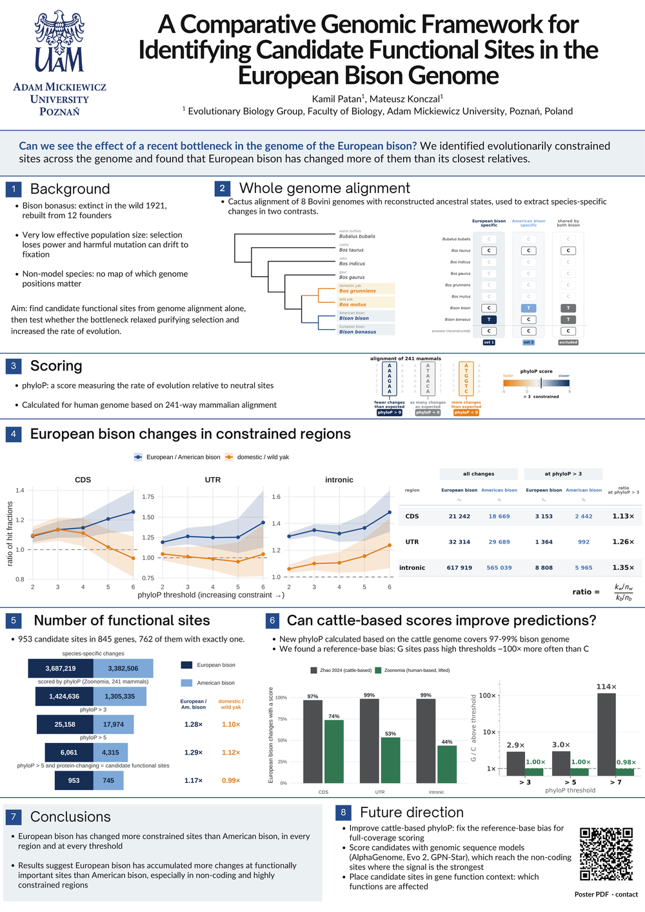

# EuropeanBison-ptbi2026
# A Comparative Genomic Framework for Identifying Candidate Functional Sites in the European Bison Genome

**Kamil Patan**, Mateusz Konczal

Evolutionary Biology Group   
Faculty of Biology   
Adam Mickiewicz University, Poznań, Poland

Poster presented at PTBI 2026.

## Poster

[Open the poster (PDF)](Poster_Bison.pdf) · [Download](https://github.com/Kamil-Patan/EuropeanBison-ptbi2026/raw/main/Poster_Bison.pdf)

## Contact

dr hab. Mateusz Konczal - mateusz.konczal@amu.edu.pl   
Kamil Patan — kampat1@amu.edu.pl

Happy to talk about the framework, the conservation-score bias, or applying either to other bottlenecked species.

Analysis code is not yet public.
